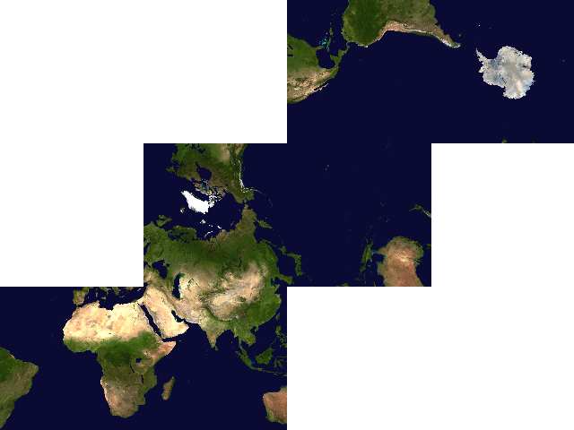
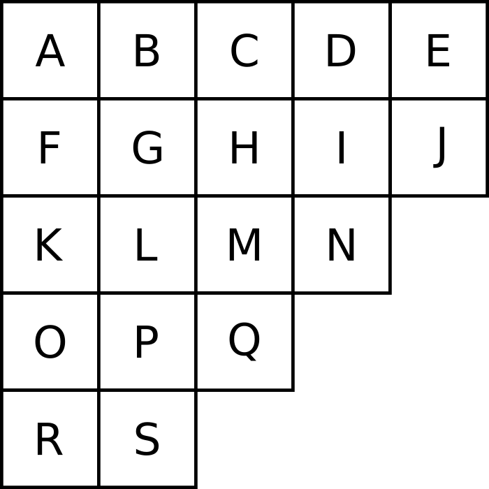
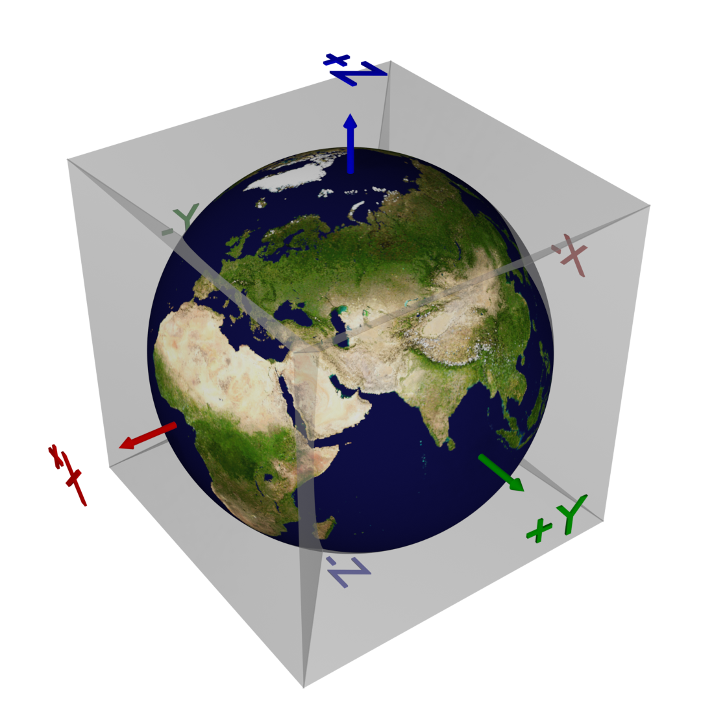
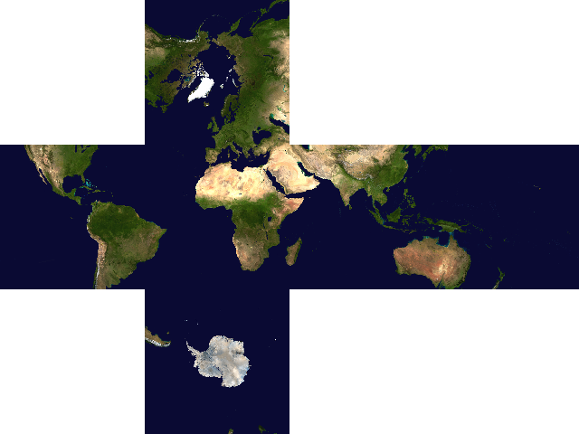
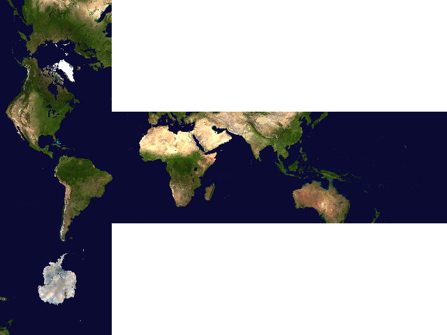
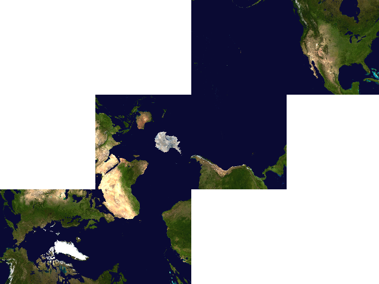

.. _gcs:

********************************************************************************
Gnomonic Cubed-Sphere
********************************************************************************

+---------------------+----------------------------------------------------------+
| **Classification**  | Pseudocylindrical                                        |
+---------------------+----------------------------------------------------------+
| **Available forms** | Forward and inverse, spherical projection                |
+---------------------+----------------------------------------------------------+
| **Defined area**    | Global                                                   |
+---------------------+----------------------------------------------------------+
| **Alias**           | gcs                                                      |
+---------------------+----------------------------------------------------------+
| **Domain**          | 2D                                                       |
+---------------------+----------------------------------------------------------+
| **Input type**      | Geodetic coordinates                                     |
+---------------------+----------------------------------------------------------+
| **Output type**     | Projected coordinates                                    |
+---------------------+----------------------------------------------------------+

   proj-string: ``+proj=gcs +lon_0=-10``

Parameters
################################################################################

.. note:: All parameters are optional for the Gnomomic projection.

.. option:: +cube_net
    
    Cube net definition.
    
    *Defaults to "KHLCGD"*

.. option:: +cube_face
    
    Selects a specific face. Indexed according to :literal:`+cube_index`.

.. option:: +cube_index
    
    Specifies user indicies of faces. Order is {+X, -X, +Y, -Y, +Z, -Z}. Indicies must be 0--6 (allowing 0- or 1-based indexing).

    *Defaults to "031425"*

.. option:: +center_origin
    
    Sets false origin to the center of the selected face. Only valid if :literal:`+cube_face` is given.
    
.. option:: +tlat
    
    Target latitude for the Schmidt transform.
    
.. option:: +tlon
    
    Target longitude for the Schmidt transform.

.. option:: +stretch_factor
    
    Stretch factor for the Schmidt transform.
    

.. include:: ../options/lat_0.rst

.. include:: ../options/lon_0.rst

.. include:: ../options/x_0.rst

.. include:: ../options/y_0.rst

.. include:: ../options/ellps.rst

.. include:: ../options/R.rst

Cube Net Encoding
################################################################################

Examples
################################################################################

   proj-string: ``+proj=gcs +cube_net=gihfbl``

   proj-string: ``+proj=gcs +cube_net=gihfak +lon_0=+10``

   proj-string: ``+proj=gcs +tlat=40 +tlon=-100 +stretch_factor=2``